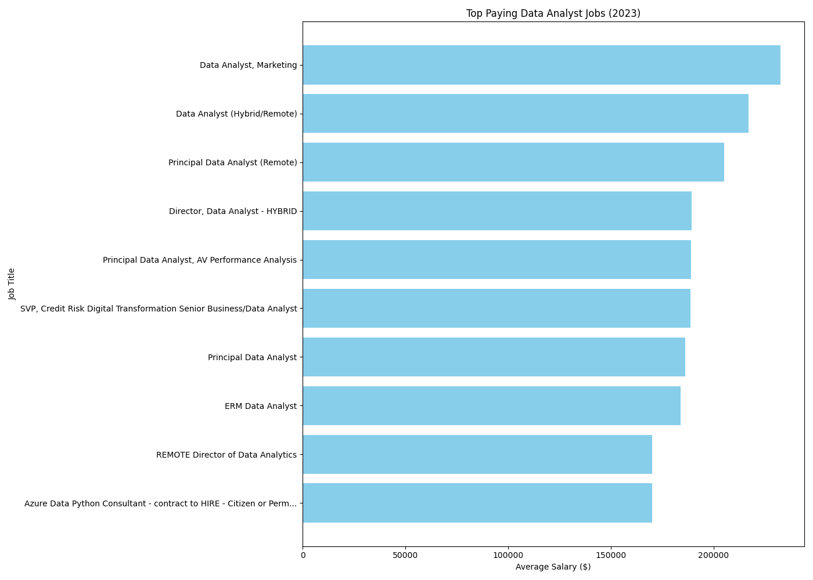
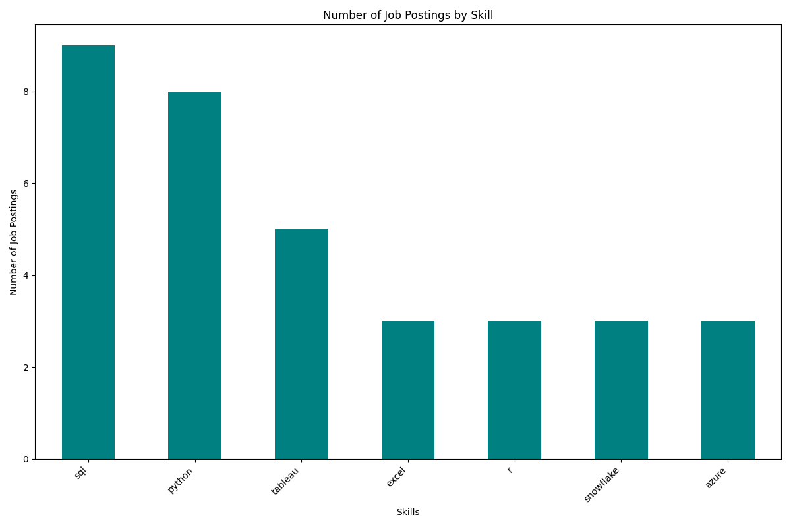

 # Introduction
 Data Job Market 📊💼 <br>
The data job market is booming 🚀, driven by the rapid growth of data-driven decision-making across industries 🌐. This project focuses on Data Analyst roles that are remote 🏡 or located in central Florida 🌴, exploring top-paying jobs 💰, in-demand skills 🔧, and where high demand meets salary in data analytics 📈!"

SQL Queries? Check them out here: [project_sql folder](project_sql)

 # Background
Wanting to learn SQL skills, I decided to give this highly rated [course](https://www.youtube.com/watch?v=7mz73uXD9DA) a try. The course is led by Luke Barousse, who thoughfully and carefully leads you through the course. He demonstrates his workflow and, when making mistakes, goes step-by-step on how to debug your code rather than skipping to the final product.

For more info,including the data for this analysis, check out [his course](https://www.lukebarousse.com/sql). It has Free and Paid options.

### The questions answered through our analysis:

1. What are the top-paying jobs for my role?
2. what are the skills required for these top-paying roles?
3. What are the most in-demand skills for my role?
4. What are the top skills based on salary for my role?
5. What are the most optimal skills to learn?
    
 # Tools I Used
For my deep dive into the data analyst job market, I used several key tools:

- **SQL**: This tool's strength in querying databases quickly enabled me to analyze this data set
- **PostgresSQL**: The chosen database management system, ideal for handling this dataset.
- **VS Code**: The Swiss Army knife of code editors; it can do just about anything with a plugin here or there.
- **Git and GitHub**: Versioning control and sharing what I learned, ensuring collaboration and project tracking

 # The Analysis
 Each query for this project aims at investigating specific aspects of the data analyst job market.
 Here's how I approached each question:

 ### 1. What are the top-paying jobs for my role?
 To identify the top-paying roles, I filtered Data Analyst positions by average yearly salary and location, focusing on central florida or remote opportunities. This query highlights the high paying opportunites with this filter in mind.

```sql
SELECT
    job_id,
    name AS company_name,
    job_title,
    job_location,
    job_schedule_type,
    salary_year_avg,
    job_posted_date
FROM
    job_postings_fact
LEFT JOIN company_dim AS companies ON job_postings_fact.company_id = companies.company_id
WHERE
    (job_location = 'Anywhere' OR
    job_location = 'Tampa, FL' OR
    job_location = 'Orlando, FL')
    AND salary_year_avg IS NOT NULL
    AND salary_year_avg < 250000 --Removes some outliers in the data
    AND job_title_short = 'Data Analyst'
ORDER BY salary_year_avg DESC
LIMIT 10
```


*Bar graph visualizing the salary for the top 10 salaries  for data analysts; ChatGPT and pythonfiddle created this graph from my SQL Query result*

 ### 2. What are the skills required for these top-paying roles?
To identify the top skills required for Query 1(Q1), I created a CTE and enclosed Q1 within it. By comparing this against the skills table, the result includes all skills needed by those top jobs, sorted by salary high to low.

```sql
WITH top_paying_jobs AS (
    SELECT
        job_id,
        name AS company_name,
        job_title,
        job_location,
        salary_year_avg
    FROM
        job_postings_fact
    LEFT JOIN company_dim AS companies ON job_postings_fact.company_id = companies.company_id
    WHERE
        (job_location = 'Anywhere' OR
        job_location = 'Tampa, FL' OR
        job_location = 'Orlando, FL') AND
        salary_year_avg IS NOT NULL AND
        job_title_short = 'Data Analyst'
    ORDER BY salary_year_avg DESC
    LIMIT 10
)

SELECT 
    top_paying_jobs.*,
    skills
FROM top_paying_jobs
INNER JOIN skills_job_dim ON top_paying_jobs.job_id = skills_job_dim.job_id
INNER JOIN skills_dim ON skills_job_dim.skill_id = skills_dim.skill_id
ORDER BY salary_year_avg DESC
```

*Bar graph visualizing the skill count for the top 10 salaried jobs for data analysts (omitted results less than 2); ChatGPT and pythonfiddle created this graph from my SQL Query result*

 ### 3. What are the most in-demand skills for my role?
Using similar filters from Q1 (central florida & remote), I used the data to understand the demand based on skills. This query highlights the number of job postings for the skill, along with the skill name. 

```sql
SELECT 
    skills,
    COUNT(skills_job_dim.job_id) AS demand_for_skill
FROM job_postings_fact
INNER JOIN skills_job_dim ON job_postings_fact.job_id = skills_job_dim.job_id
INNER JOIN skills_dim ON skills_job_dim.skill_id = skills_dim.skill_id
WHERE
    job_title_short = 'Data Analyst' AND
    (job_location = 'Tampa, FL' OR
     job_location = 'Orlando, FL' OR
     job_work_from_home = TRUE)
GROUP BY skills
ORDER BY demand_for_skill DESC
```

| Skills    | Demand for Skill |
|-----------|------------------|
| sql       | 8307             |
| excel     | 5427             |
| python    | 4819             |
| tableau   | 4259             |
| power bi  | 2979             |

 ### 4. What are the top skills based on salary for my role?
To identify top skills based on salary, I filtered out salary data that is Null, any skills to jobs less than 20 (outliers), then queried the average year salary based on the skill. I included number of jobs to see how much the average was weighted vs having several outliers

```sql
SELECT 
    skills,
    AVG(salary_year_avg)::FLOAT(2) AS avg_salary,
    COUNT(skills_job_dim.job_id) AS number_of_jobs
FROM job_postings_fact
INNER JOIN skills_job_dim ON job_postings_fact.job_id = skills_job_dim.job_id
INNER JOIN skills_dim ON skills_job_dim.skill_id = skills_dim.skill_id
WHERE
    salary_year_avg IS NOT NULL 
    AND job_title_short = 'Data Analyst'
GROUP BY skills
HAVING COUNT(skills_job_dim.job_id) >= 20    
ORDER BY avg_salary DESC
LIMIT 20
```

| Skills      | Average Salary | Number of Jobs |
|-------------|----------------|----------------|
| kafka       | 129,999.16     | 40             |
| pytorch     | 125,226.20     | 20             |
| perl        | 124,685.75     | 20             |
| tensorflow  | 120,646.84     | 24             |
| airflow     | 116,387.26     | 71             |
| scala       | 115,479.53     | 59             |
| linux       | 114,883.20     | 58             |
| confluence  | 114,153.12     | 62             |
| pyspark     | 114,057.87     | 49             |
| mongodb     | 113,607.71     | 52             |
| gcp         | 113,065.48     | 78             |
| spark       | 113,001.94     | 187            |
| databricks  | 112,880.73     | 102            |
| git         | 112,249.64     | 74             |
| snowflake   | 111,577.73     | 241            |
| shell       | 111,496.45     | 44             |
| unix        | 111,123.32     | 37             |
| hadoop      | 110,888.27     | 140            |
| pandas      | 110,767.07     | 90             |
| phoenix     | 109,259.09     | 23             |

 ### 5. What are the most optimal skills to learn?
The last query I performed, is the combination of several of the queries before. i first used CTEs of 3 & 4 and receieved the results. However. I found it pretty clunky and a bit confusing, so it was refactored to something more managable(below). This query recieves the skills, count of jobs for the skill, and the average of salaries for the skill,sorted by salary highest.


```sql
SELECT 
    skills_dim.skill_id,
    skills,
    COUNT(skills_job_dim.job_id) AS demand_count,
    ROUND(AVG(job_postings_fact.salary_year_avg), 0) AS avg_salary
FROM job_postings_fact
INNER JOIN skills_job_dim ON job_postings_fact.job_id = skills_job_dim.job_id
INNER JOIN skills_dim ON skills_job_dim.skill_id = skills_dim.skill_id
WHERE
    job_title_short = 'Data Analyst'
    AND salary_year_avg IS NOT NULL
    AND (
            job_location = 'Tampa, FL' OR
            job_location = 'Orlando, FL' OR
            job_work_from_home = TRUE
        )
GROUP BY skills_dim.skill_id
HAVING 
    COUNT(skills_job_dim.job_id) >10
ORDER BY
    avg_salary DESC,
    demand_count DESC
LIMIT 25;
```

| Skills       | Demand Count | Avg Salary |
|--------------|--------------|------------|
| pandas       | 11           | 142,399    |
| databricks   | 13           | 133,774    |
| snowflake    | 41           | 112,836    |
| hadoop       | 28           | 112,685    |
| confluence   | 12           | 110,942    |
| bigquery     | 13           | 109,654    |
| azure        | 41           | 109,553    |
| aws          | 35           | 108,176    |
| go           | 34           | 107,962    |
| java         | 21           | 105,591    |
| oracle       | 43           | 105,190    |
| looker       | 50           | 103,689    |
| dax          | 11           | 103,182    |
| jira         | 25           | 102,893    |
| ssis         | 20           | 102,863    |
| nosql        | 16           | 102,482    |
| python       | 255          | 101,099    |
| redshift     | 16           | 99,936     |
| r            | 165          | 99,724     |
| spark        | 17           | 99,452     |
| tableau      | 252          | 98,205     |
| flow         | 33           | 97,884     |
| javascript   | 25           | 97,653     |
| sas          | 69           | 97,570     |


 # What I learned
Starting this course, I had only done random queries and did not fully understand the purpose behind them. This course is chock full of good practices, helpful hints and engaging exercises. I now know how to use  fundemental and advanced SQL queries to create some pretty satisfying results.

Aggregation functions were really neat to see the data shape up into ways I would think before would only be done on a Pivot table for example. 


 # Conclusions

 ### INSIGHTS
 1. **Top-paying Data Analyst Jobs**: The highest paying jobs that allow remote work can be in the 200k range!
 2. **Skills for Top-Paying jobs** The top skills for top paying jobs are SQL, Python, Tableau and Excel.
 3. **Most In-Demand Skills** The highest demanded skills for Remote job postings are SQL, Excel, Python, Tableau and Power BI.
 4. **Skills with Higher Salaries** The highest paying skills for remote jobs are Kafka, PyTorch, Perl, and TensorFlow. THis speaks to specific expertise offering a higher paying position. PyTorch and TensorFlow are specifically Geared toward AI, which should be kept in mind for the future. AI assitance with Data tasks seems inevitable. 
 5. **Optimal Skills for Job Market Value** SQL is the most in demand skill, and offers a high average salary across all job postings. Notably, python, offers a slightly higher average pay, which tend to indicate that would be a good path to go down. Lastly, visualization tools have a combined gravity close to equal that of SQL itself, indication that data visualization is a key skill to know in this industry.
 ### Closing thoughts

I can say, i know way more about SQL now then I did a week ago. This course has supercharged my learning in this subject. 

What I realize though, is that since this is guided, its easy to think I have it down, when in reality, I know i will struggle with actually correlating the data I need into the query. Basically, the human element. Luke said grab this data from this set and compare it this way. In the real world, their won't likely be a luke over your shoulder to guide you. I would like to continue to practice this human part of data analysis.
